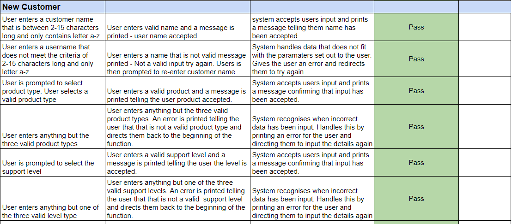

# Table of Contents

- [Purpose](#purpose)
    - [Target Audience](#target-audience)
- [User-Stories](#user-stories)
    - [First-Time-Visitor-Goals](#first-time-visitor-goals)
    - [Returning-Visitor-Goals](#returning-visitor-goals)
    - [Frequent-Visitor-Goals](#frequent-visitor-goals)
    - [Owner-Goals](#owner-goals)
- [Design](#design)
    - [Colour-Scheme](#colour-scheme)
    - [Imagery](#imagery)
- [Flow-Chart](#flow-chart)
- [Features](#features)
    - [Existing-Features](#existing-features)
    - [Features-left-to-Implement](#features-left-to-implement)
- [Testing](#testing)
    - [Calculation-Testing](#calculation-testing)
    - [Manual-Testing](#manual-testing)
    - [Validator-Testing](#validator-testing)
    - [Bugs](#bugs)
- [Deployment](#deployment)
- [Credits](#credits)
    - [Content](#content)
    - [References](#references)
    - [Technologies](#technologies)
- [Acknowledgements](#acknowledgements)
- [Disclaimer](#disclaimer)

# Sales Calculator

## Purpose
The purpose of this site is to provide the user with pricing for their renewal quotes. It has specifically created for renewal representitives who work for Quest Software. They input some details: the price, level and product and the system will provide them with the new pricing for this years quote. They can also choose to get the pricing for a 2 year and 3 year quote so they can easily provide all options to the customer.
This program also stores the customer data so that the user can access previous quote prices for their reference. 
The purpose of this site is to streamline the renewal process for these sales representitives. Many of thier quotes need to be manually priced so this site can help them to work out the pricing of a quote in a more efficient way.

The program is written using Python, runs in a Command Line Interface and is deployed via Heroku. You can visit the live website [here](https://renewal-calculator-p3.herokuapp.com/)

# Target Audience
The Target Audience for this website is sales reps specifically the sales reps who work for my current employer Quest software. These reps have a number of manual calculatitons that needs to be done to prepare a quote for their customer, this has to be done for thousands of quotes every three months. Part of my role in the past was to price these quotes for the reps. There is a definate need here for something that makes the process easier and more streamlined. This app is designed to take away some of this manual work so that the sales rep can concentrate on selling the products to the customer rather than focusing so much time on administration work.
This is the sort of functionality that many CRM systems implement to streamline quoting for customers. 

# User Stories

## First Time Visitor Goals
As a first time visitor I want to be able to choose what product I am working with and the support level so I can get an accurate calculation for my renewal quote. 
I also wants to be able to get the price for a 2 or 3 year renewal so I can present the three options to my customer.
I want to be able to input the customer name and spcific data of this quote and have it stored by the system in a google sheet so I can access this data again at a later stage. 
As a first time visitor (Or Returning/ Frequent) I want the program to be simple and easy to use. 
As a first time visitor (Or Returning/ Frequent) I want the system to work even if I input the wrong type of data.

## Returning Visitor Goals
A returning visitor wants to be able to use the app to price a quote just as the first time visitor. But this user also wants to be able to access previous quote data for users so they can see a list of previous priced quotes for this customer.

## Frequent Visitor Goals
A frequent Visitor wants to be able to price new quotes and also get previous pricing for a specific customer if there is any.

# Owner Goals
- As the owner, I want to provide a program that fulfils the users’ needs.
- As the owner, I want to make it immediately obvious what the program is for.
- As the owner, I want to provide clear and accurate information.
- As the owner, I want to create an experience that is pleasant for users.
- As the owner, I want the program to continue without crashing due to an error caused by user input.

# Design

## Colour scheme

As this is a terminal based application the level of detail for colour in page are a little limited. 
I have imported colours from the Python library colorama and also the Python Libary Rich. I have tried to use the colours consistently throughout the program.
- Purple - The introduction message on the home page is in purple 
- Green - All input messages are green to make then stand out to the user.
- Yellow - confirmation messages to the user are yellow
- Red - Error Messages are in Red, this colour is used as Red would be familiar to the user as the colour commonly used for an error.

## Imagery

I have used an image of a calculator, it is just a simple image but draws the users eye. It also helps to make the purpose of the site clear right from the initial page.

# Flow Chart

# Features 

## Existing Features

### Into Page
When the program loads the user is Greated with text welcoming them to the Renewal Calculator and an image of a calculator. There is a description of what the program does. It then gives the user two options they can either choose to start a new calculation or they can get access to historical data for their customer. 
They are then prompted to enter which option they would like to go for by inputting 1 for new calculation or 2 for historical data.

### New Calculation
If the user selects to start a new calculation they are then prompted to enter their customer's name. There is a message outlining the format the customer name must take. If the customer name fits the convention then a message is printed telling the user that the customer name is accepted. If the user enters a format that is not accepted they will recieve and error message telling them the name they have entered is not valid and they will be prompted to re-enter the user name.

### Product Select
Once the user has entered a customer name that is accepted by the system they will then be prompted to select the product their quote is for, either Toad or Kace. 
If the enter anything other than Toad or Kace they will get an error stating Invalid input and they will be prompted to try again.

### Level Select
 Once they have entered the amount the user is then asked to select the level of support on the quote, is it standard, mid or premier. The product type and support level determine the pricing that is applied to the quote.

### Enter Amount
The user is then prompted to enter the amount for last years renewal quote.

### Print Calculation
The program then checks the price the user has entered against a price book I have created in a google sheet. 

 If the price is below what is in the google sheet an uplift is applied but if the user has entered a price that matches or is above the price that is in the price book the system will inform them that the  calculation can not be done as their quote had already reached list  price. 
 If the price is below the list price then the applicable uplift will be applied and the price will be printed.

 

### Second and Third Year Calculation 

The user can also have the system calculate the price for a second and third year. This is calculated at 90% of the 1 year price for the second year and 85% of the one year price for the third year. This is following the pricing guidelines that the reps in my company follow, the discount is applied to incentivies customers to renew for more than one year. So this calculator quickly presents the pricing for all three years.

 

### Save 
The usesr is then prompted to either save their details or exit. If they choose the save the details are saved to a google sheet. They can then be accessed by the user at a later date by entering the customer name.

### Access stored data
The user can enter the customer  name and any saved details for this customer will be printed to the terminal. It gives the customer name, product, supporot level and the pricing for One, Two and three years. 

 

 ### Note on Features

 - I have chosen to store all input from the user as lower case. This way when they user is accessing their saved details if they used capital letters or not wont matter, it will convert their input to lower case and match the name to the saved lower case details in the google sheet.

 - When the user enters details, if their details are accepted by the program a message will be printed in yellow telling the user it has been accepted. This is good for the user as it lets them know that what they have entered is accepted and the program is running as expected.

 - A google sheet is used to store the details entered by the user when they choose to save them. It also holds the pricebook that the program checks to make sure the users input is not above the list price and so can be uplifted. You can see an example of how the data is saved below:

 ### Features Left to Implement
Currency converter. I hope in future to implement a currency converter as part of this renewal calculator.

# Testing

### Calculation Testing
The first thing I tested was that the calculations done in the app were actually correct. I built a calculator in Google sheets and gave the input of 30 euro for each support level and type to check what the output was. I then did the same in the calculator I input 30 for each of the types and support level and saved each to the google sheets. All the prices for the uplift and the two and three years matched my google sheet calculation so I know it was working correctly.

As you can see in the two images below the output is the same from the google sheets and the app itself. 

### Manual Testing

When the program had been successfully deployed to Heroku, I followed the logic flow through all the user actions that can be taken in the app to check that it responded appropriately:

### Validator Testing

The Python code was run through the PEP8 online:

I initially obtained a large amount of "unexpected space around keyword/parameters equals". I had not realised that I should not put a space between the word style and the equal sign and the parameter for Rich. I removed these spaces across the program and this resolved most of the erros. 

I also recieved some errors for lines being to long. So I spent time making sure that my lines were not longer than 80 characters and that follow on lines were properly indented. 

Once I fixed these issues the code then passed successfully.

# Bugs

## Current Bugs

To the best of my knowledge there are no bugs currently in this program.

## Resolved Bugs

- I had an issue when the user went through and did a new calculation when they went back to the start page and selected to exit the calculator, it wouldnt exit but instead displayed the menu from the save function. I realised I needed to enter break points so that this part of the save function would not keep running when the user exited to the home page. Once I entered them it fixed this bug.

- I was encountering a bug when the user entered anything that wasnt a number. It was causing the program to crash. I implemented a try except block. This handled the exception if the user enters something that isnt a number and instead of crashing the program prints and error and directs the user back to the start of the function.

# Deployment

## Gitpod and GitHub

The Code Institute Python Essentials Template on GitHub was used to develop this project. This template was designed by Code Institute to provide a terminal that can be viewed in the browser.
This is the link to the template :
https://github.com/Code-Institute-Org/python-essentials-template

Steps to use the template:
- From the link above, click "use this template". You will be taken to a screen to create a new repository from this template.
- Give your repository a name.
- Click "create repository from template" and your repository will be created.
- In the new repository, click the green "Gitpod" button to open the workspace in Gitpod.

## Google Sheets

You must generate credential and provide them to your program to allow your project to access Google Sheets.

Steps to generate the credentials:

- Navigate to the Google Cloud Platform
- Click "select a project".
- Click "new project".
- Give the project a name.
- Click "create".
- From the project's dashboard, select 'APIs and services' and then 'Library'.
- Search for Google Drive API and enable it.
- Select "create credentials".
- From the "Which API are you using?" dropdown menu, choose "Google Drive API".
- For the "What data will you be accessing?" question, select "Application Data".
- For the "Are you planning to use this API with Compute Engine, Kubernetes Engine, App Engine, or Cloud Functions?" question, select "No, I'm not using them".
- Enter a Service Account name.
- In the Role Dropdown box choose Basic > Editor then press Continue.
- Click "Done".
- On the next page, click on the Service Account that has been created.
- On the next page, click on the Keys tab.
- Click on the Add Key dropdown and select Create New Key
- Select JSON and then click Create. This will trigger the json file with your API credentials in it to download to your machine.

Steps to allow the program access using the credentials:

- Drag and drop the downloaded json file containing the credentials into your Gitpod workspace.
- Rename the file to creds.json for ease of use.
- In the creds.json file, find the "client_email" value and copy the email address (without the surrounding quotes).
- In the Google Sheet, click the green "share" button in the top right.
- Paste in the email, make sure "Editor" is selected, untick "Notify People", and then click "Share".

Steps to ensure that the credentials file is stored securely and details are not shared with GitHub:

- Open the "gitignore" file in Gitpod.
- Add "creds.json" (without the quotes) to the gitignore file and save the file.

## Heroku

- Before using Heroku, create a list of any dependencies that have been installed in your workspace by using the command "pip3 freeze  > requirements.txt" in the terminal. This will modify the requirements.txt file to allow Heroku to install these dependencies as well.
- Log in to Heroku or create an account if required.
- Click the button labelled "New" from the dashboard in the top right corner  
- From the drop-down menu select "Create new app".
- Enter a unique app name. The name must be unique across all of Heroku, not just unique to your own account.
- Once the green tick is displayed to confirm the name is original, select your region.
- Click on the "Create app" button.
- This will bring you to the project "Deploy" tab. From here, navigate to the settings tab and scroll down to the "Config Vars" section.
- Click the button labelled "Reveal Config Vars" and enter the "key" as port, the "value" as 8000 and click the "add" button.
- For projects such as this where a creds.json file is used, the Config Vars must also be updated to take account of this file, since it cannot be shared via GitHub because it was never uploaded to GitHub.
- In the field for "key", enter CREDS.
- Copy the entire creds.json file from the workspace and then paste it into the "value" and click the "add" button.
- Go to the "buildpacks" section of the settings page and click the button labeled "add buildpack," select "python," and click "Save Changes".
- Repeat the above step, but this time add "node.js" instead of python. Note that the buildpacks must be in the correct order. They can be dragged into the correct position if needed.
- At the top of the settings page, and navigate to the "Deploy" tab.
- Select Github as the deployment method.
- Confirm that you want to connect to GitHub.
- Search for the repository name as it is saved on GitHub, and click the "connect" button next to the correct repository.
- At the bottom of the deploy page, select your "Enable Automatic Deploys" if you would like updates to be deployed automatically when you push updates to Github.
- Alternatively, click the "Deploy Branch" button to deploy updates manually. This would then need to be updated manually with any further changes.
- Click "view" to view the deployed site.

# Credits

### Content

- All text used throughout the site was written by me.
- I have taken my pricing model from the company I work for - Quest Software. I have added some complexity to the pricing model just to create a more interesting and challenging app. But the idea of an uplift and the discounted second and third year price I have modeled on the pricing rules they I work with every day.

### References

- I  made extensive use of the Love Sandwiches tutorials on Code Institute when creating this project, it was a starting point and helped me in my understanding of how to manipulate data in a google sheet. 

- I used this video series linked in the Rich git hub repsoitory to help my understanding of how to use rich - https://calmcode.io/rich/introduction.html

- I watched this tutorial to help with my understanding of how the use Pandas with Python - https://www.youtube.com/watch?v=vmEHCJofslg

### Technologies
- Gitpod is an online integrated development environment that was used to write my code.
- Git was used for version control by committing changes via Gitpod. Changes are then stored by pushing them to GitHub.
- GitHub was used to store the project code after pushing it from Git.
- Heroku is a platform as a service (PaaS) that enables developers to build, run, and operate applications entirely in the cloud, and was used to deploy the live project.
- The Code Institute Python Essentials Template on GitHub was used to develop this project.
- https://www.asciiart.eu/electronics/calculators - I got the image of a calculator from this site. I modified it slightly to show correctly in the terminal.
- Google sheets - Used to store the user data and also the price list.
- Pandas - I used Pandas for manipulation the data from the google sheet.
- Colorama https://pypi.org/project/colorama/  - I used Colorama specifically for the input fields as I was getting an error when trying to use the RICH API for the input.
- https://realpython.com/python-exceptions/ - I referenced this site for my exception handling.
- https://peps.python.org/pep-0008/ - I referenced PEP8 to confirm my styling was correct.
- https://github.com/Textualize/rich - I used rich to add colour to text and also for positioning of the calculator image. I also used the Rich api for generating the tables in the app.
- Time api -I used this API to have the app pause at times so the user can read any messages being displayed.

# Acknowledgements
- Thank you to my mentor Ronan McClelland for all his support and advice.
- Thanks to my husband and children who are so supportive of my learning journey with Code Institue. 

# Disclaimer
This website is for educational use only.